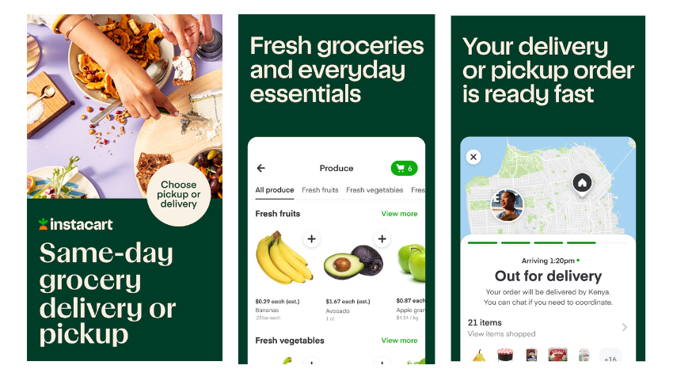
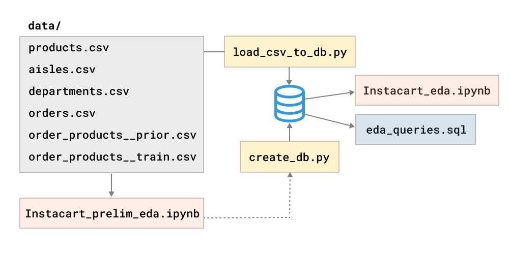

# Unpacking Instacart: A Deep Dive into North American Grocery E-Commerce Behaviour

**Instacart** is the leading grocery technology company in North America, partnering with more than 1,400 national, regional, and local retail banners to deliver from more than 80,000 stores across more than 14,000 cities in North America.

## Project Description
The key objective of the project is to uncover patterns in the purchasing habits of Instacart shoppers and
provide recommendations based on the average shopper profile.

**Main questions to answer:**
- What shopper behaviour is at different hours of the day, different days of the week?
- How many items do people buy?
- How many days pass before people place another order?
- How many items do people buy since a previous order?
- Which items are the best-sellers? 
- Which items are most frequently reordered?
- Which items are added to the cart first? second? third?
- How often and when are products from different department/aisle sold?

**Project goals:**
1. Extract data from the data source.
2. Load data to SQL database.
3. Provide answers to the main business questions, using:
   + (a) SQL queries, or
   + (b) Jupyter notebook & Python code.

## Dataset Overview
### Source
“The Instacart Online Grocery Shopping Dataset 2017”, accessed from https://www.kaggle.com/competitions/instacart-market-basket-analysis/data.
### Dataset structure
This anonymized dataset contains a sample of over 3 million grocery orders from more than 200,000 Instacart users.
Most of the files and variable names should be self-explanatory.

The dataset is a relational set of **7 files** describing customers' orders over time:
* products.csv
* aisles.csv
* departments.csv
* orders.csv
* order_products__SET (see **SET** described below)

#### Key data descriptions
* order_id: order identifier
* user_id: customer identifier
* eval_set: which evaluation set this order belongs in (see **SET** described below)
* order_number: the order sequence number for this user (1 = first, n = nth)
* order_dow: the day of the week the order was placed on
* order_hour_of_day: the hour of the day the order was placed on
* days_since_prior: days since the last order, capped at 30 (with NAs for order_number = 1)
* add_to_cart_order: order in which each product was added to cart 
* reordered: 1 if this product has been ordered by this user in the past, 0 otherwise

SET is one of the four following evaluation sets (eval_set in orders):
* "prior": orders prior to that users most recent order (~3.2m orders)
* "train": training data supplied to participants (~131k orders)
* "test": test data reserved for machine learning competitions (~75k orders)

In the 'orders' table, "train" and "test" identify the last order for every user, and are randomly split between train and test.
They are "future data", but only on a per-user basis (e.g., the last order for user X might be earlier than the first order for user Y).

**NOTE**: This dataset includes orders from many different retailers and is **a heavily biased subset** of Instacart’s production data.
And so it is not a representative sample of its products, users or their purchasing behavior.

## Setup & Requirements
Follow these steps to get the data analysis project up and running on your local machine.

### Prerequisites
1. **Python**: This project requires Python 3.9 or higher.
If you don't have Python installed, [download and install](https://www.python.org/downloads/) the latest version.
2. **Jupyter Notebook**: Jupyter Notebook is used for the interactive analysis. If you don't have it, install it using pip:
``pip install jupyter``

### Setting Up a Virtual Environment (Recommended)
It's recommended to set up a virtual environment to avoid any package conflicts.
1. Install `virtualenv` if not installed: ``pip install virtualenv``
2. Navigate to the project directory and create a virtual environment: ``virtualenv venv``
3. Activate the virtual environment:
    - **Windows**: ``.\\venv\\Scripts\\activate``
    - **macOS/Linux**: ``source venv/bin/activate``

### Installing Required Libraries
With the virtual environment activated, install the necessary libraries using:
``pip install -r requirements.txt``

### Getting the Data
This project uses the `The Instacart Online Grocery Shopping Dataset 2017` dataset.
1. Download the dataset from [this link](https://www.kaggle.com/competitions/instacart-market-basket-analysis/data).
2. Place the downloaded dataset in the `data/` directory (create the directory if it doesn't exist).

### Running the Notebook
With everything set up, start the Jupyter Notebook server: ``jupyter notebook``
Navigate to the desired notebook and you're ready to start your analysis!

## Methodology
* ELT pipeline
* Exploratory data analysis (EDA)
* Descriptive statistics
* Unsupervised ML: clustering

## Project Structure
This repository contains all the necessary code and scripts for performing a detailed basket analysis on shopper data.
Below is a comprehensive breakdown of the project structure to guide you through its various components.

### Directory Structure & Components

### 1. `data/`
This directory contains raw dataset files.

### 2. Scripts
- `create_db.py`: Python script that sets up the necessary SQL database schema. Run this script first if you're setting 
up the database from scratch.
- `load_csv_to_db.py`: A utility script that uploads the dataset from the `data/` folder to the SQL database. 
Useful for initial data loading.
- `Instacart_eda.sql`: SQL script that contains quiries for exploratory data analysis (answers the same questions as in the `Instacart_eda.ipynb`).

### 3. Notebooks
- `Instacart_prelim_eda.ipynb`: A notebook used during the initial phases of the project.
It's designed to help understand the dataset's nature, its structure, and the relationships between different files.
- `Instacart_eda.ipynb`: The main Jupyter notebook where the comprehensive data analysis is performed.
N.B.: This notebook leverages data both from the SQL database and local `data/` folder for optimal performance.

### Getting Started
1. **Database Setup**:
    - Run the `create_db.py` script to create the required SQL database structure.
    - Upload your dataset into the SQL database using the `load_csv_to_db.py` script.
2. **Preliminary Data Exploration**:
    - If you're new to the dataset, the `preliminary-data-exploration.ipynb` notebook will be beneficial in understanding the data's intricacies.
3. **Instacart Market Basket Analysis**:
    - Dive deep into the `instacart-market-basket-analysis.ipynb` notebook for a thorough exploration and insights related to shoppers' basket analysis.

## Findings & Conclusions

### Average Shopper Profile for Instacart

**Order Frequency and Timing:**
- The average Instacart user places orders approximately once a week, with a median interval of 7 days between orders.
- Peak shopping hours are from 10:00 to 16:00, with a majority of orders being placed between 8:00 and 19:00.
- Sundays and Mondays are the most popular shopping days, especially from Sunday afternoon to Monday afternoon.

**Order Size and Frequency:**
- Each user places between 4 and 100 orders in total, with each order containing an average of 8 products.
- Typical orders consist of 1 to 27 products, with outliers ranging from 28 to 145 products per order.
- Initial orders usually contain around 10 products, with the maximum being 17 products.

**Re-ordering Patterns:**
- Regular users order groceries more frequently, sometimes multiple times a week, while occasional users order less frequently (once every two weeks or once a month).
- For re-orders:
    - Within 6 days: average purchase of 9 to 14 products.
    - 7 days or more: average purchase increases to 15 products.

#### Shopping Preferences
**Product Types:**
- Fresh fruits and vegetables are the top-selling and most frequently reordered items, with bananas, strawberries, avocados, and spinach being the most popular.
- Users prioritize health-conscious choices, with organic whole milk also being a best-seller.
- Bread, dairy products, and non-perishable items are not as frequently reordered.

**Aisles and Departments:**
- The most frequently visited aisles are those dedicated to fresh produce and dairy & eggs.
- Popular aisles also include bread, lunch meat, baby food formula, cereal, and soup broth bouillon.
- Major departments include snacks, beverages, frozen foods, and pantry goods.

**Initial and Subsequent Purchases:**
- Users often start their shopping with essential items like bananas, strawberries, avocados, spinach, whole milk, raspberries, lemons, and limes.
- Secondary additions to the cart include Fuji apples, cucumber kirbi, blueberries, yellow onions, and half & half.
- Products like soda, reduced-fat milk, Hass avocados, garlic, and honeycrisp apples are added later in the shopping process.

#### Shopping Behavior

**Day of the Week Trends:**
- Higher activity from Sunday afternoon to Monday afternoon, likely due to restocking after the weekend.
- Stable order volumes from Tuesday to Friday between 9:00 and 16:00, with a slight dip around lunchtime.
- Lower order volume on Saturdays, potentially due to household activities and outdoor engagements.

**Item Quantity and Order Trends:**
- For initial orders, users purchase an average of 10 products.
- For re-orders within short intervals (less than 6 days), users buy 9 to 14 products.
- For re-orders after longer intervals (7 days or more), users buy 15 to 30 products. 

**Re-ordering Frequency by Product Type:**
- Fresh fruits are reordered more frequently than vegetables, likely due to shorter shelf life and versatile consumption options.
- High-reordering frequency for yogurt, soy/lactose-free products, bread, refrigerated items, eggs, and cheese, but in smaller quantities.
- Least likely to reorder: spices, seasonings, condiments, and baking ingredients.

## Recommendations
- Prioritize displaying these essential products prominently when users log in or visit the site. 
- Offer bundle deals and recommend related products to increase the average order value.

#### Inventory management:
  * Ensure the consistent availability of top-selling and frequently re-ordered products to maintain customer satisfaction and a smooth supply chain. 
  * Ensure continuous availability and optimal stock levels for produce and dairy eggs, as these departments account for nearly 46% of orders. Regularly monitor inventory to prevent stockouts of high-demand items. 
  * Prioritize restocking and expanding popular aisles within the produce and dairy eggs departments. Consider increasing the variety of fresh fruits, vegetables, and dairy products to meet customer demand.

#### Enhance Product Visibility:
  - Highlight products from top departments (produce and dairy eggs) on the homepage and in marketing campaigns to drive sales. Utilize advertising banners and product recommendations to promote these items.
  - Create dedicated sections on the platform for popular aisles from smaller or niche departments (e.g., bakery, deli, breakfast) to increase their visibility and encourage purchases. 

#### Targeted Marketing and Promotions:
  * Offer bundle deals and discounts on frequently reordered items to increase average order value. For example, create bundles that include staple items like bananas, strawberries, and spinach with complementary products.
  * Implement loyalty programs or subscription services for high-demand categories (e.g., produce and dairy) to encourage repeat purchases and improve customer retention. 
  * Develop targeted marketing campaigns for different customer segments based on their purchasing behavior. For example, promote health-focused products to health-conscious customers and convenience items to busy professionals.

#### Improve Pantry Department Offerings:
  - Evaluate the extensive selection of pantry items and identify low-performing products. Focus on stocking high-demand items and consolidating less popular ones to streamline the inventory. 
  - Provide detailed product descriptions, usage tips, and recipe ideas for pantry items to increase their appeal and drive sales. Highlight the versatility and benefits of these products to attract more customers.