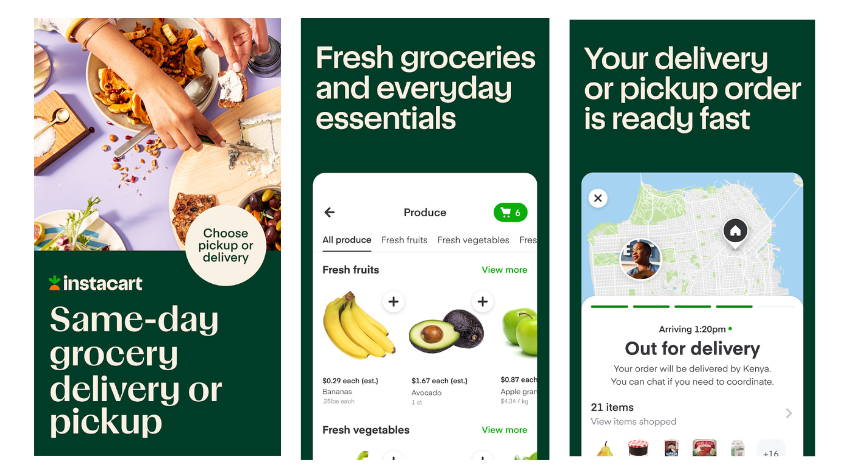

# Unpacking Instacart: A Deep Dive into North American Grocery E-Commerce Behavior
**Instacart** is the leading grocery technology company in North America, partnering with more than 1,400 national, regional, and local retail banners to deliver from more than 80,000 stores across more than 14,000 cities in North America.

## Project Description
The primary objective of the project is to delve into the Instacart sales data and craft every conceivable insight that can contribute to the further business growth.

**Main questions to answer:**
- What shopper behaviour is at different hours of the day?
- What shopper behaviour is at different days of the week?
- How many days pass before people place another order?
- How many items do people buy?
- Which items are the best sellers?
- Which items are most frequently reordered?
- Which items are added to the cart first? Second? Third?
- How often are products from the department/aisle sold?

## Dataset Overview
### Source
“The Instacart Online Grocery Shopping Dataset 2017”, accessed from https://www.instacart.com/datasets/grocery-shopping-2017 on 13.08.2023.
### Dataset structure
This anonymized dataset contains a sample of over 3 million grocery orders from more than 200,000 Instacart users.
Most of the files and variable names should be self-explanatory.

The dataset is a relational set of **7 files** describing customers' orders over time:
* orders.csv
* products.csv
* aisles.csv
* departments.csv
* order_products__SET (see **SET** described below)

#### Key data descriptions
* order_id: order identifier
* user_id: customer identifier
* eval_set: which evaluation set this order belongs in (see **SET** described below)
* order_number: the order sequence number for this user (1 = first, n = nth)
* order_dow: the day of the week the order was placed on
* order_hour_of_day: the hour of the day the order was placed on
* days_since_prior: days since the last order, capped at 30 (with NAs for order_number = 1)
* add_to_cart_order: order in which each product was added to cart 
* reordered: 1 if this product has been ordered by this user in the past, 0 otherwise

SET is one of the four following evaluation sets (eval_set in orders):
* "prior": orders prior to that users most recent order (~3.2m orders)
* "train": training data supplied to participants (~131k orders)
* "test": test data reserved for machine learning competitions (~75k orders)

## Setup & Requirements

## Methodology
* ETL framework
* Exploratory data analysis (EDA)
* Descriptive statistics
* Time series analysis

## Findings & Conclusions

## Project Structure

## Changelog/Updates